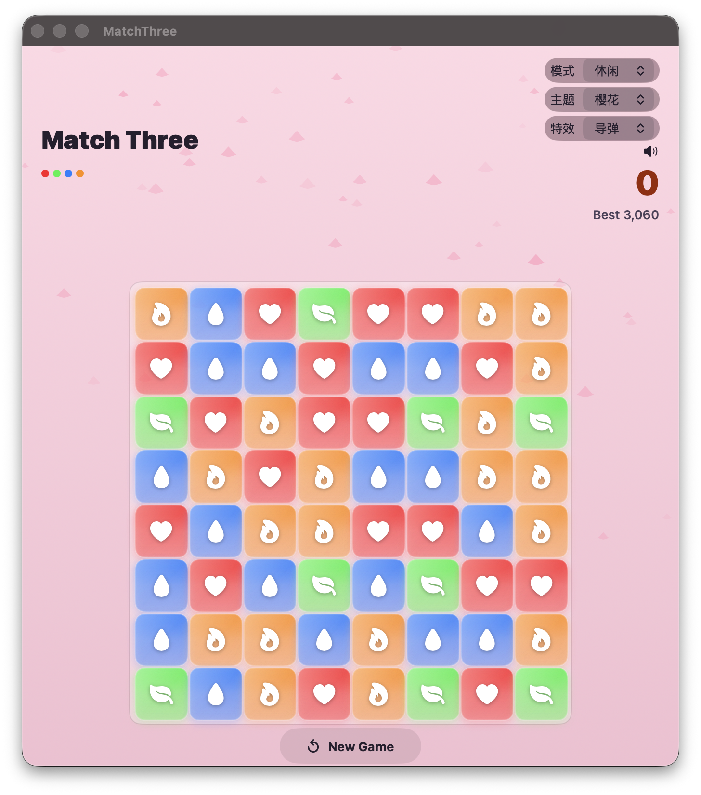

# Match Three

macOS-native match-3 puzzle game built with SwiftUI. Pure local, no backend.



An iOS baseline lives at [MatchThree-iOS](https://github.com/lispv/MatchThree-iOS).

## Features

- 8×8 grid, 8 gem types (4 initially, unlock as you score)
- Click-to-select, adjacent swap, chain reactions
- **3 themes**: Skynet (dark/red), Sakura (pink petals), Seaside (ocean bubbles)
- **Special gems**: 4-match bomb (3×3 clear), 5-match rainbow (swap clears all same color)
- **2 modes**: Casual (unlimited), Ranked (5 failed swaps = loss, 10s countdown)
- **2 match effects**: Cruise missile, Block shatter
- Particles, screen shake, neon glow
- Deadlock detection + auto reshuffle

## Run

### Command line (no Xcode needed)

```bash
swiftc -parse-as-library -o build/MatchThree \
  Models.swift GameBoard.swift Views.swift MatchThreeApp.swift \
  -framework SwiftUI \
  -sdk $(xcrun --show-sdk-path --sdk macosx)

open build/MatchThree
```

### Xcode project (optional)

```bash
xcodegen generate     # requires XcodeGen
open MatchThree.xcodeproj
```

Requires macOS 14+ with Xcode Command Line Tools.

## Project structure

```
Models.swift         — data types, enums, audio engine, haptic engine, score manager
GameBoard.swift      — game logic (grid, matching, gravity, chain processing, deadlock)
Views.swift          — SwiftUI views (gems, particles, overlays, content view)
MatchThreeApp.swift  — @main app entry point
project.yml          — XcodeGen project spec (macOS target)
```

## License

MIT
